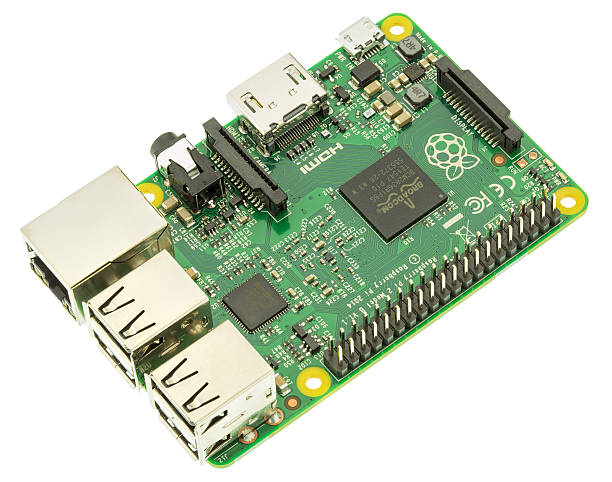
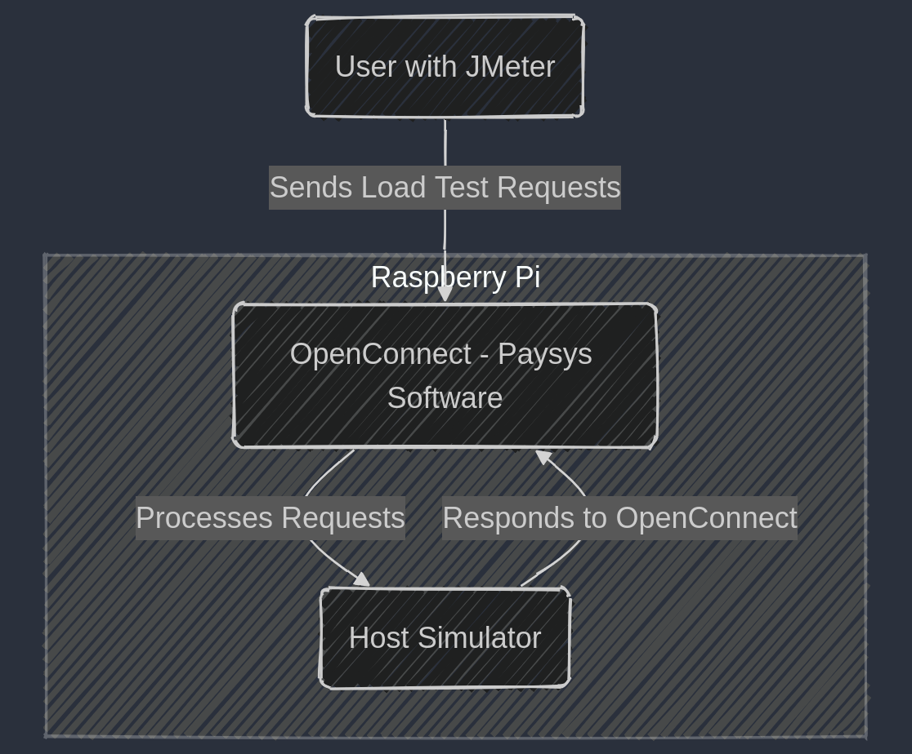
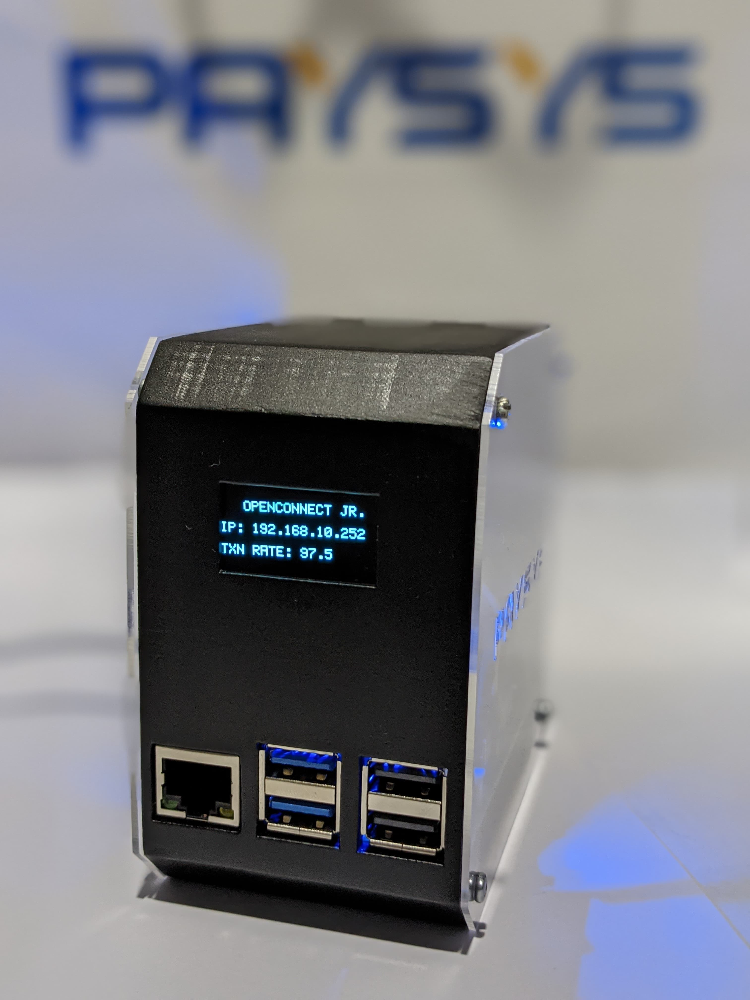

  <h1>OPENCONNECT JR</h1>

  

## Overview
**OPENCONNECT** is an advanced transaction processing solution developed by **Paysys Labs**, designed to provide secure, reliable, and high-performance financial transactions. It is engineered to handle high transaction loads efficiently, ensuring seamless payment processing for financial institutions and businesses.

To enhance portability and ease of deployment, we have configured **OPENCONNECT** on a **Raspberry Pi 5**, transforming it into a **plug-and-play solution** that delivers robust transaction processing capabilities in a compact and cost-effective form factor. Through extensive optimizations, our implementation achieves an impressive transaction rate (throughput) of **95+ transactions per second**, making it a powerful yet lightweight processing unit.

## What is Raspberry Pi 5?  
The **Raspberry Pi 5** is the latest iteration of the **Raspberry Pi** series—an affordable, credit-card-sized single-board computer (SBC) designed for a wide range of applications, including **IoT, embedded systems, and industrial automation**. Developed by the **Raspberry Pi Foundation**, it delivers **significantly improved processing power, faster memory, and enhanced I/O capabilities** compared to its predecessors.  

  

### Key Features of Raspberry Pi 5:  
- **Processor**: Quad-core **ARM Cortex-A76** @ **2.4 GHz** (2–3× faster than Raspberry Pi 4)  
- **Memory**: **4GB / 8GB LPDDR4X RAM** for high-performance multitasking  
- **Storage**: Supports **microSD cards** and high-speed **NVMe SSDs** via PCIe 2.0  
- **Connectivity**: **Gigabit Ethernet, Wi-Fi, Bluetooth 5.0**, and **2× USB 3.0** for faster data transfers  
- **Graphics**: **VideoCore VII GPU** with dual **4K HDMI** output support  
- **Power Efficiency**: Lower power consumption with active cooling support for sustained performance  

This guide provides detailed instructions on how to perform a **stress test** on **OPENCONNECT JR** running on a **Raspberry Pi 5** using **JMeter**. The test will help evaluate system performance under load and validate its ability to handle high transaction volumes effectively.

### Flow Chart for OPENCONNECT JR:  

  

### OpenConnect JR - Performance: 
We successfully stress-tested **OpenConnect JR** with **140 threads** under room temperature conditions and moderate network speed, achieving an impressive **throughput of 97.5** transactions per second. With a cooler environment, the system has the potential to reach even higher transaction rates, further optimizing its performance.  

  

##  Software Stack
To ensure optimal performance and efficient transaction processing, the following software components are utilized:  

- **OpenConnect** – The primary software driving transaction handling and communication.  
- **RabbitMQ** – A reliable message broker for efficient data exchange and queuing.  
- **MySQL Database** – Used for storing and managing transaction records securely.  
- **Python Scripts** –  
  - **Simulator Script**: Simulates transaction flows for testing and performance evaluation.  
  - **Display Script**: Handles the user interface and displays real-time throughput statistics.  
- **Operating System**:  
  - **Raspberry Pi OS** – A Linux Debian-based OS optimized for Raspberry Pi hardware, ensuring stability and compatibility.
## What's in the Box  
The **OpenConnect JR Kit** includes all the essential components required for seamless operation. The package contains:  

- **OpenConnect JR Device** – The core unit responsible for processing and handling transactions.  
- **Power Adapter (Charger)** – Ensures stable power supply for uninterrupted performance.  
## Prerequisites
- Raspberry Pi 5 with **OPENCONNECT JR** installed
- Ethernet cable with internet connection
- JMeter installed on your machine
- `.jmx` test plan file (attached in this repository)

## Setup Instructions
1. **Connect Ethernet:**
   - Plug an Ethernet cable into the **Raspberry Pi 5** Ethernet port.
   - Ensure your machine is on the **same network** as the Raspberry Pi.

2. **Power On the Raspberry Pi:**
   - Turn on the Raspberry Pi using the charger inside the box.
   - The screen connected to the Raspberry Pi will display its **IP address**.

3. **Configure JMeter:**
   - Open **JMeter** on your machine.
   - Load the provided `.jmx` test plan file.

4. **Run the Stress Test:**
   - Start the JMeter test.
   - The Raspberry Pi screen will display the **transaction rate per 10 seconds**.

## Monitoring & Results
- Observe the **JMeter output** to analyze request performance.
- The Raspberry Pi screen will update with transaction rates in **real-time**.

## Troubleshooting
- If JMeter cannot reach the Raspberry Pi, verify:
  - Your machine and the Raspberry Pi are on the **same network**.
  - The Raspberry Pi's **IP address** matches the one in the `.jmx` file.
- If the transaction rate is too low:
  - Increase the number of **threads/users** in JMeter.

---
